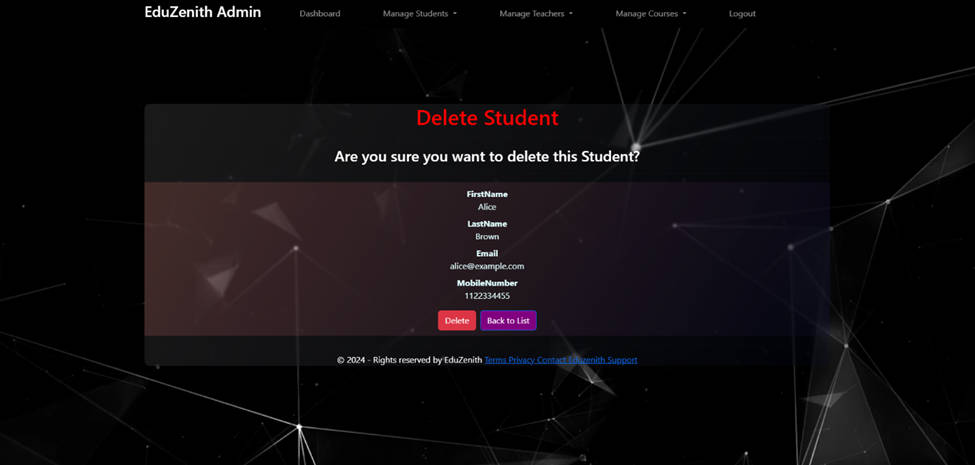

# EduZenith Student Management System
***By Rizoan Hossain and Nafia tabassum Shouty***

EduZenith is a comprehensive **educational management system** designed to streamline the interaction between **students, teachers, and administrators**. It offers three distinct panels with role-specific features, ensuring a smooth academic and administrative experience. EduZenith was build using ASP.net MVC framework with Software engineering principles and analysis.

The project encompasses a comprehensive educational management system with three
distinct panels:

- Student,
- Teacher, and
- admin.
  
Each panel is equipped with specific functionalities tailored to their roles. Users access these
panels via a main dashboard, where they can log in and manage their activities. Key features
include:

- student and teacher registration,
- course enrollment (Available Courses, Enrolled Courses),
- grading systems for teachers,
- and robust administrative controls for
❖ managing student,
❖ managing teacher and
❖ managing courses
The system ensures efficient management of student enrollments, course offerings, and
academic interactions, enhancing overall educational administration and user experience.
---
### Read the full documentation here :- https://drive.google.com/file/d/1gB_LPKuKXelcXkja_n7xBFlvuWYBciSU/view?usp=sharing

Project demo video from Shouty's Channel : https://www.youtube.com/watch?v=5Rz3NHnbkNg&list=PL8vqxEFyqfFC_loGB4JXLzKfuaqP374Xp&index=5
## 🚀 Features

### 👨‍🎓 Student Panel
- Secure login & registration
- Profile management
- Course enrollment (view available & enrolled courses)
- Access course materials, announcements, and timelines
- Participate in discussions (posts & comments)
- Take quizzes and view instant results
- View grades & progress

### 👩‍🏫 Teacher Panel
- Secure login & registration
- Manage assigned courses and students
- Upload course content and announcements
- Grade student performance
- Create and manage quizzes
- Interact with students via posts & comments

### 🛠 Admin Panel
- Manage student & teacher registrations (approve/decline)
- Add, update, or delete courses
- Oversee enrollments and system activity
- Maintain system security and integrity
- Full CRUD operations on users and courses

---

## 📊 Feasibility

- **Technical**: Cross-browser support, optimized design, responsive UI  
- **Economical**: Development cost ~41,000tk; potential revenue ~300,000tk/month  
- **Operational**: Provides learning & teaching zones, resource sharing, collaboration tools  

---

## ⚙️ Requirements

- **Functional**: Course enrollment, material sharing, grading, admin oversight  
- **Non-Functional**:  
  - Portability (cross-browser)  
  - Security (admin-controlled approvals, secure login)  
  - Maintainability (modular MVC design)  
  - Reliability & Scalability (database optimization)  
  - Performance (fast response times)  

---

## ⚠️ Risks & Mitigation

- **Fake Profiles** → Admin verification & continuous monitoring  
- **Illegal Activities** → Oversight of enrollments & notifications  
- **Development Delays** → Cross-trained team, backups, feature prioritization  

---

## 🎯 Project Goals

1. Enhance student-teacher engagement  
2. Streamline course management & grading  
3. Simplify administrative tasks  
4. Improve communication & announcements  
5. Ensure data security & scalability  
6. Provide a user-friendly, responsive experience  
7. Promote inclusivity & accessibility  

---

## 🛠️ Tech Stack

- **Languages & Frameworks**: C#, ASP.NET MVC, JavaScript  
- **Database**: SQL Server (MSSQL)  
- **Frontend**: HTML, CSS, Bootstrap  
- **IDE**: Visual Studio 2022  

---

## 📐 System Design

- **Use Cases**: Login, Registration, Enrollment, Course Management, Posts, Comments, Grading  
- **DFDs & ERD**: Student, Teacher, Course, Grade, Post, Comment, Enrollment  
- **Entity Relations**: Many-to-Many (Students–Courses, Teachers–Courses, Students–Grades)  

---

## 👥 Contributions

- **Nafisa (55%)**: Database (major), Student panel backend, Quizzes, Grading, Admin-student control  
- **Rizoan (45%)**: Teacher panel backend, Admin-teacher control, Course deletion, Frontend design  

---

## 📸 Screenshots

### 🏠 Main Dashboard

---

### 👨‍🎓 Student Panel
  
-
  
-
  
-
  
-
  
-
 
-
 
- 
  
-

---

### 👩‍🏫 Teacher Panel

-
  
-
  
-
  
-
  
-
  

---

### 🛠 Admin Panel
  
-
  
-
  
-
  
-
  
-
  
-
  
-
  
-
  
-
  
-
  
-
  

---

### 📝 Quiz Panel
  
  
  

EduZenith is built with **scalability, security, and usability** at its core. It modernizes educational management by integrating **learning, teaching, and administration** in one unified platform. With planned enhancements (AI, mobile app, gamification), EduZenith aims to become a **next-generation educational hub**.  

---
